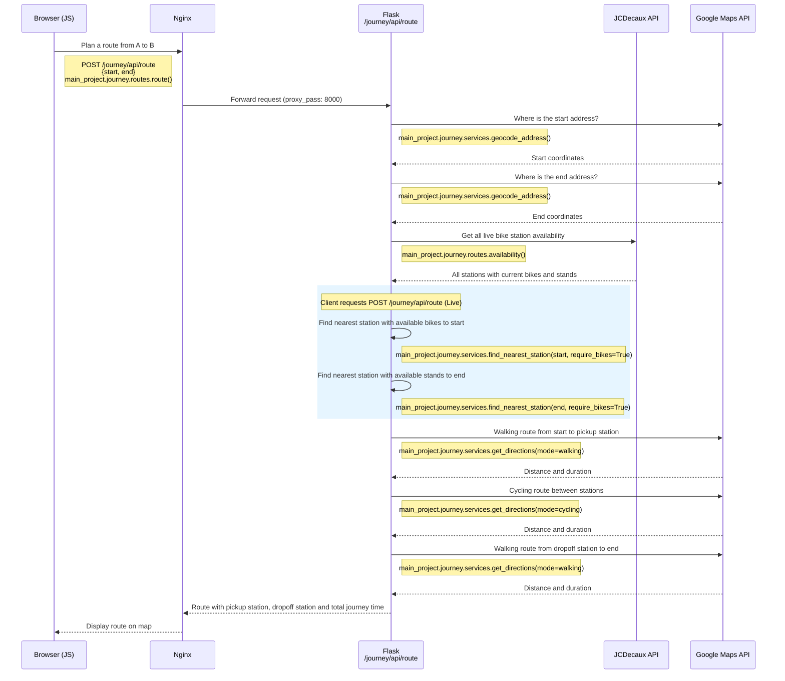
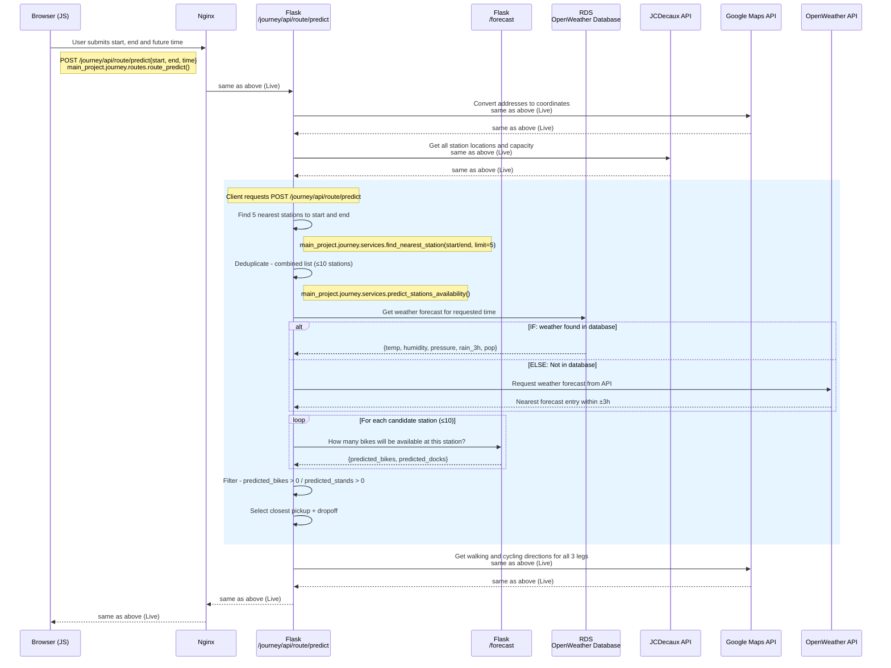
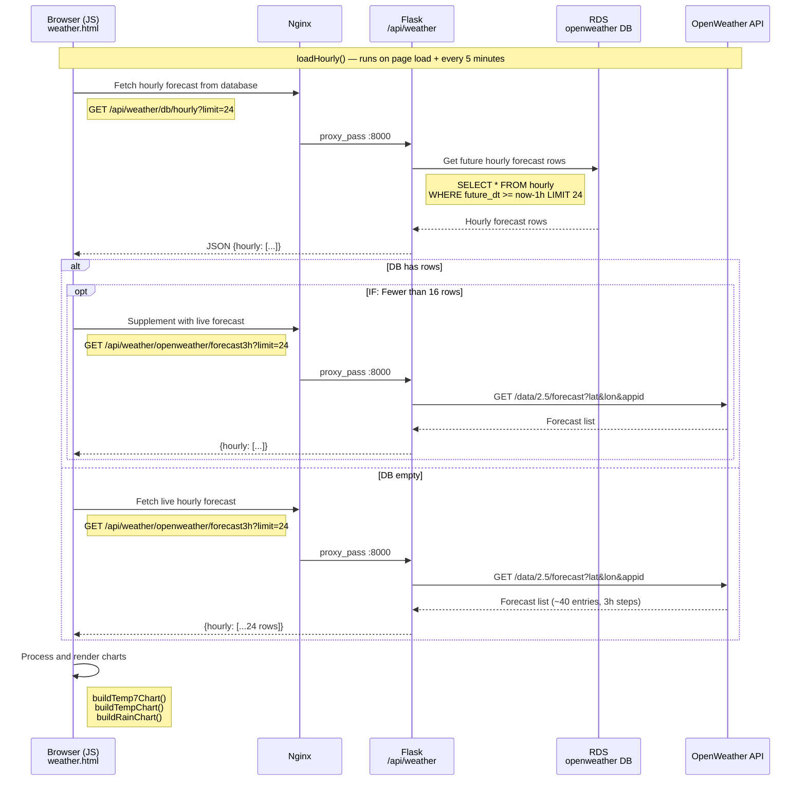
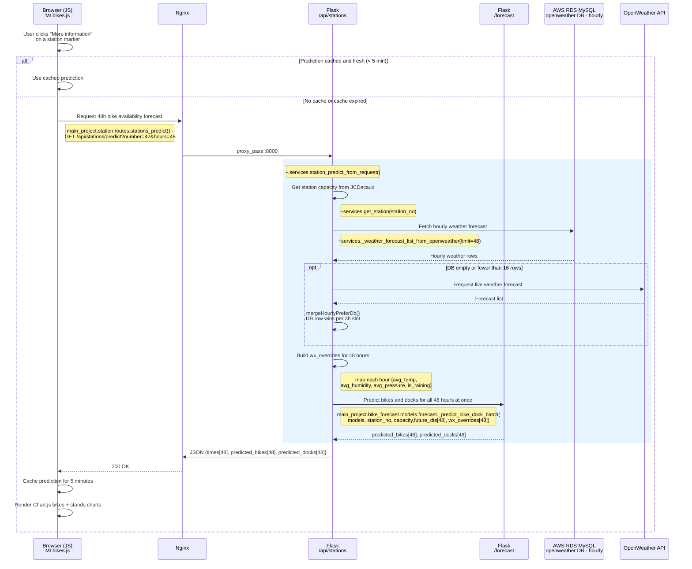

# Sequence Diagram

## Journey Planning - Live

- **POST /api/route**

```mermaid
sequenceDiagram
    participant BR as Browser (JS)
    participant NG as Nginx
    participant FL as Flask<br/>/journey/api/route
    participant JCD as JCDecaux API
    participant GM as Google Maps API

    BR->>NG: Plan a route from A to B 
    Note right of BR: POST /journey/api/route<br/>{start, end} <br> main_project.journey.routes.route()
    NG->>FL: Forward request (proxy_pass: 8000)
 

    
    FL->>GM: Where is the start address?
    Note right of FL: main_project.journey.services.geocode_address()
    GM-->>FL: Start coordinates
    FL->>GM: Where is the end address?
    Note right of FL: main_project.journey.services.geocode_address()
    GM-->>FL: End coordinates
  

    FL->>JCD: Get all live bike station availability
    Note right of FL: main_project.journey.routes.availability()
    JCD-->>FL: All stations with current bikes and stands
rect rgb(230, 245, 255)
Note over FL: Client requests POST /journey/api/route (Live)
    FL->>FL: Find nearest station with available bikes to start
    Note right of FL: main_project.journey.services.find_nearest_station(start, require_bikes=True)
    FL->>FL: Find nearest station with available stands to end
    Note right of FL: main_project.journey.services.find_nearest_station(end, require_bikes=True)
end
    
   FL->>GM: Walking route from start to pickup station
   Note right of FL: main_project.journey.services.get_directions(mode=walking)
   GM-->>FL: Distance and duration
   
   FL->>GM: Cycling route between stations
   Note right of FL: main_project.journey.services.get_directions(mode=cycling)
   GM-->>FL: Distance and duration
   
   FL->>GM: Walking route from dropoff station to end
   Note right of FL: main_project.journey.services.get_directions(mode=walking)
   GM-->>FL: Distance and duration
  

    FL-->>NG: Route with pickup station, dropoff station and total journey time
    NG-->>BR: Display route on map
```

## Journey Planner - forecast

```mermaid
sequenceDiagram
    participant BR as Browser (JS)
    participant NG as Nginx
    participant FL as Flask <br/> /journey/api/route/predict
    participant ML as Flask <br/> /forecast
    participant RDS as RDS <br> OpenWeather Database
    participant JCD as JCDecaux API
    participant GM as Google Maps API
    participant OWM as OpenWeather API
   
    
    
		BR->>NG: User submits start, end and future time
    Note right of BR: POST /journey/api/route/predict{start, end, time}<br> main_project.journey.routes.route_predict()
    NG->>FL: same as above (Live)
    FL->>GM: Convert addresses to coordinates <br> same as above (Live)
    GM-->>FL: same as above (Live)
    FL->>JCD: Get all station locations and capacity<br/> same as above (Live)
    JCD-->>FL: same as above (Live)

rect rgb(230, 245, 255)
Note over FL: Client requests POST /journey/api/route/predict
        FL->>FL: Find 5 nearest stations to start and end
        Note right of FL: main_project.journey.services.find_nearest_station(start/end, limit=5)
        FL->>FL: Deduplicate - combined list (≤10 stations)
        Note right of FL: main_project.journey.services.predict_stations_availability()
        FL->>RDS: Get weather forecast for requested time
        
        alt IF: weather found in database
            RDS-->>FL: {temp, humidity, pressure, rain_3h, pop}
        else ELSE: Not in database
            FL->>OWM: Request weather forecast from API
         
            OWM-->>FL: Nearest forecast entry within ±3h
        end
        loop For each candidate station (≤10)
            FL->>ML: How many bikes will be available at this station?
           
            ML-->>FL: {predicted_bikes, predicted_docks}
        end
        FL->>FL: Filter - predicted_bikes > 0 / predicted_stands > 0
        FL->>FL: Select closest pickup + dropoff
    end

    FL->>GM: Get walking and cycling directions for all 3 legs <br> same as above (Live)
    GM-->>FL: same as above (Live)
    FL-->>NG: same as above (Live)
    NG-->>BR: same as above (Live)
```

### Weather - Forecast

```mermaid
sequenceDiagram
    participant BR as Browser (JS)<br/>weather.html
    participant NG as Nginx
    participant FL as Flask <br> /api/weather
    participant RDS as RDS <br/>openweather DB 
    participant OWM as OpenWeather API

    Note over BR,OWM: loadHourly() — runs on page load + every 5 minutes

    BR->>NG: Fetch hourly forecast from database
    Note right of BR: GET /api/weather/db/hourly?limit=24 
    NG->>FL: proxy_pass :8000
    FL->>RDS: Get future hourly forecast rows
    Note right of FL: SELECT * FROM hourly<br/>WHERE future_dt >= now-1h LIMIT 24
    RDS-->>FL: Hourly forecast rows
    FL-->>BR: JSON {hourly: [...]}

    alt DB has rows
        opt IF: Fewer than 16 rows
            BR->>NG: Supplement with live forecast
            Note right of BR: GET /api/weather/openweather/forecast3h?limit=24
            NG->>FL: proxy_pass :8000
            FL->>OWM: GET /data/2.5/forecast?lat&lon&appid
            OWM-->>FL: Forecast list
            FL-->>BR: {hourly: [...]}
        end
    else DB empty
        BR->>NG: Fetch live hourly forecast
        Note right of BR: GET /api/weather/openweather/forecast3h?limit=24
        NG->>FL: proxy_pass :8000
        FL->>OWM: GET /data/2.5/forecast?lat&lon&appid
        OWM-->>FL: Forecast list (~40 entries, 3h steps)
        FL-->>BR: {hourly: [...24 rows]}
    end

    BR->>BR: Process and render charts
    Note right of BR: buildTemp7Chart()<br/>buildTempChart()<br/>buildRainChart()
```

## Station

```mermaid
sequenceDiagram
    participant BR as Browser (JS)<br/>MLbikes.js
    participant NG as Nginx
    participant FL as Flask <br/> /api/stations
    participant ML as Flask <br/> /forecast
    participant RDS as AWS RDS MySQL<br/>openweather DB · hourly
    participant OWM as OpenWeather API
    

    BR->>BR: User clicks "More information"<br/>on a station marker

    alt Prediction cached and fresh (< 5 min)
        BR->>BR: Use cached prediction
    else No cache or cache expired
        BR->>NG: Request 48h bike availability forecast
        Note right of BR: main_project.station.routes.stations_predict() - <br> GET /api/stations/predict?number=42&hours=48 
        NG->>FL: proxy_pass :8000 
rect rgb(230, 245, 255)
Note over FL: ~.services.station_predict_from_request()
        FL->>FL: Get station capacity from JCDecaux
        Note right of FL: ~services.get_station(station_no)

        FL->>RDS: Fetch hourly weather forecast
        Note right of FL: ~services._weather_forecast_list_from_openweather(limit=48)
        RDS-->>FL: Hourly weather rows

        opt DB empty or fewer than 16 rows
            FL->>OWM: Request live weather forecast
            OWM-->>FL: Forecast list
            FL->>FL: mergeHourlyPreferDb()<br/>DB row wins per 3h slot
        end

        FL->>FL: Build wx_overrides for 48 hours
        Note right of FL: map each hour {avg_temp,<br/>avg_humidity, avg_pressure, is_raining}

        FL->>ML: Predict bikes and docks for all 48 hours at once
        Note right of FL: main_project.bike_forecast.models.forecast._predict_bike_dock_batch(<br/>models, station_no, capacity,future_dts[48], wx_overrides[48])
        ML-->>FL: predicted_bikes[48], predicted_docks[48]
end
        FL-->>NG: JSON {times[48], predicted_bikes[48], predicted_docks[48]}
        NG-->>BR: 200 OK
        BR->>BR: Cache prediction for 5 minutes
        BR->>BR: Render Chart.js bikes + stands charts
    end
```